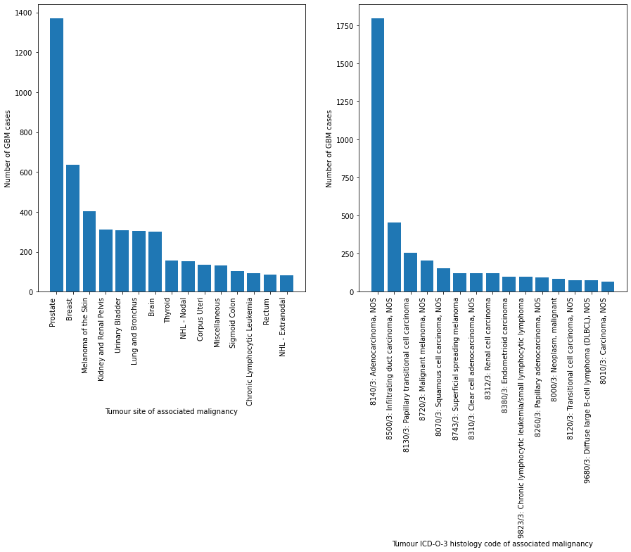
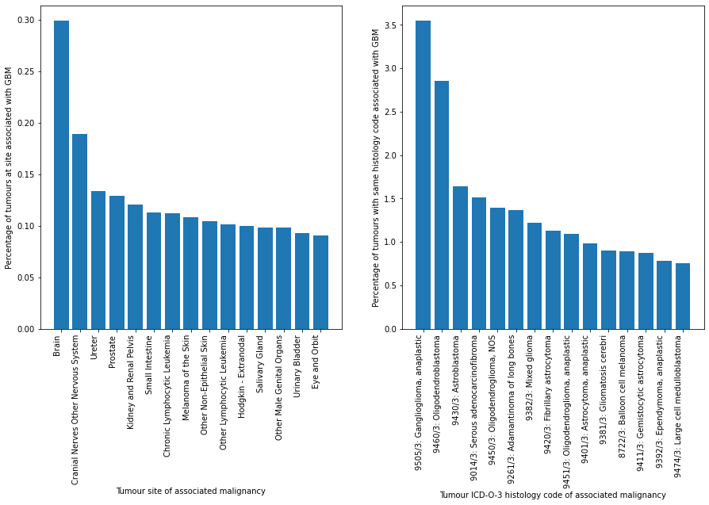
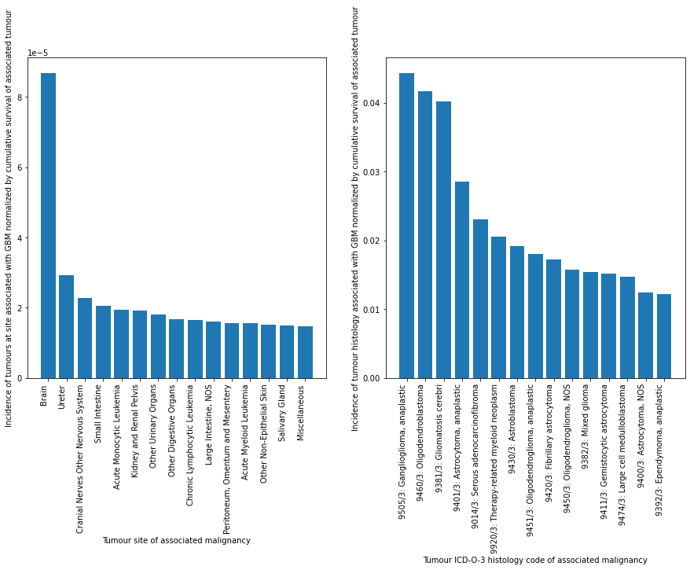

Exploring associations beteen GBM and other neoplasms using SEER dataset

**Data files**
- SEER RPD 17 Nov 2021_gbm_first.xlsx - GBM cancer entries in patients who had GBM as the first primary 
- SEER RPD 17 Nov 2021_gbm_first_rel.xlsx - All cancer entries for patients who had GBM as the first primary 
- SEER RPD 17 Nov 2021_gbm_second.xlsx - GBM cancer entries in patients where GBM was not the first primary (i.e., "secondary GBM)
- SEER RPD 17 Nov 2021_gbm_sec_rel.xlsx - All cancer entries for patients where GBM was not the first primary

**Archived files**
- export2.xlsx - case listing of all cases from SEER 22 dataset with selected variables
- export2_gbm.xlsx - case listing of all GBM cases from SEER 22 dataset
- export2_gbm_rel.xlsx - case listing of all cases co-occurring with GBM identified via patient ID

**Demo figures**
Raw association between GBM and other tumours by site and histology

Association between GBM and other tumours by site and histology (normalized by tumour site/histology incidence over entire SEER 17 dataset)

Association between GBM and other tumours by site and histology (normalized by tumour site/histology cumulative survival over entire SEER 17 dataset)
_Cumulative survival for a tumour site/histologic type is calculated as the sum of the months of survival since diagnosis over all cases in SEER 17 dataset_
