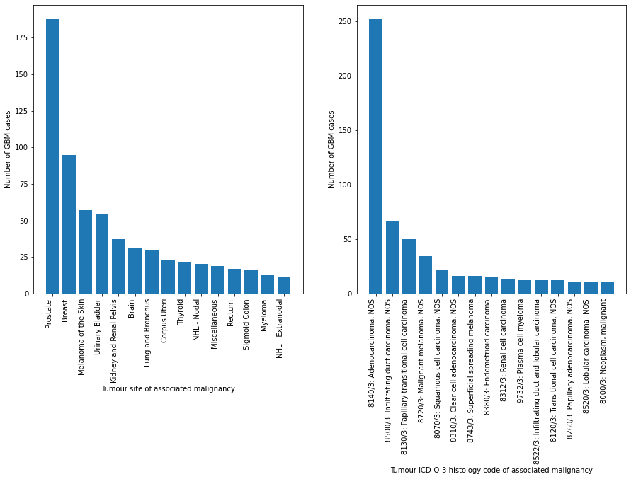

Exploring associations beteen GBM and other neoplasms using SEER dataset

**Data files**
- export2.xlsx - case listing of all cases from SEER 22 dataset with selected variables
- export2_gbm.xlsx - case listing of all GBM cases from SEER 22 dataset
- export2_gbm_rel.xlsx - case listing of all cases co-occurring with GBM identified via patient ID

**Demo figures**
